# 🚀 K8sOperation · 企业级 Kubernetes 多集群管理平台

一个对标 **Rancher/KubeSphere** 的企业级 K8s 管理平台，基于 **Go + Gin + GORM + Vue3 + client-go** 构建。

解决中大型企业 **多集群管理分散、权限隔离困难、运维效率低下** 的核心痛点。

------

## 🎯 平台定位与核心价值

| 痛点 | 解决方案 |
|------|----------|
| 多集群管理分散 | 统一控制台管理 N 个 K8s 集群（开发/测试/生产） |
| 权限隔离困难 | 三层 RBAC 模型（平台→集群→命名空间） |
| kubectl 门槛高 | 可视化操作，降低使用门槛 |
| 发布不可追溯 | CI/CD 流水线 + 审计日志 |
| 镜像管理混乱 | 多仓库接入 + 自动清理策略 |

**核心能力**：
- 🌐 **多集群资源治理** - 统一管理开发/测试/生产环境
- 🔐 **RBAC 精细化权限** - 细粒度权限隔离，满足审计要求
- 🔄 **CI/CD 发布编排** - 集成 Jenkins，支持审批/回滚
- 📦 **镜像仓库管理** - 支持 Harbor/ACR/Docker Registry
- ⚙ **平台运维监控** - 健康检查、审计日志、系统配置

------

## 🏗 技术架构

```
┌─────────────────────────────────────────────────────────────────────┐
│                    前端层 (Vue3 + Vite + Pinia)                      │
│      企业级 UI · 动态权限菜单 · 路由守卫 · v-permission 指令          │
└─────────────────────────────────────────────────────────────────────┘
                                │ RESTful API + JWT
┌─────────────────────────────────────────────────────────────────────┐
│                      后端层 (Go + Gin + GORM)                        │
│   JWT 认证 · RBAC 鉴权 · 统一错误码 · Zap 日志 · 优雅关闭            │
└─────────────────────────────────────────────────────────────────────┘
          │                    │                    │
    ┌─────┴─────┐       ┌─────┴─────┐        ┌─────┴─────┐
    │   MySQL   │       │   Redis   │        │  K8s API  │
    │  持久化    │       │ 会话/缓存  │        │  多集群    │
    │  审计日志  │       │ Token管理  │        │ client-go │
    └───────────┘       └───────────┘        └───────────┘
```

### 技术选型说明

| 层面 | 技术 | 选型理由 |
|------|------|----------|
| 后端框架 | Go + Gin | 高并发、云原生标准语言、性能优异 |
| ORM | GORM | 功能完善、支持多数据库、开发效率高 |
| 前端框架 | Vue3 + Vite | 响应式、Composition API、热更新快 |
| 状态管理 | Pinia | 轻量、TypeScript 友好 |
| 认证方案 | JWT + Redis | 无状态、可横向扩展、支持主动失效 |
| K8s 客户端 | client-go | 官方 SDK、功能完整、版本兼容好 |
| 日志系统 | Zap | 高性能、结构化日志 |

------

## 🔐 三层 RBAC 权限架构（核心亮点）

```
┌─────────────────────────────────────────────────────────────┐
│                    平台角色 (Platform Role)                  │
│         super_admin · platform_admin · developer            │
└─────────────────────────────────────────────────────────────┘
                              │
                              ▼
┌─────────────────────────────────────────────────────────────┐
│                    集群权限 (Cluster Permission)             │
│              用户可以管理哪些 K8s 集群                        │
│         cluster_admin · cluster_viewer · none               │
└─────────────────────────────────────────────────────────────┘
                              │
                              ▼
┌─────────────────────────────────────────────────────────────┐
│                 命名空间权限 (Namespace Permission)           │
│              用户在集群内可以操作哪些 namespace               │
│                    精确到 CRUD 粒度                          │
└─────────────────────────────────────────────────────────────┘
```

### 权限实现机制

**后端**：
- 每个 API 请求携带 `x-cluster-id` 头部
- 中间件校验用户对目标集群的权限
- K8s 操作使用 SubjectAccessReview 二次校验

**前端**：
- 登录时获取完整权限树，缓存到 Pinia Store
- 动态菜单：根据角色显示/隐藏菜单项
- 路由守卫：无权限页面自动拦截跳转
- `v-permission` 指令：按钮级权限控制

```vue
<!-- 按钮级权限控制示例 -->
<button v-permission="'cluster:delete'">删除集群</button>
```

------

## 🔗 项目地址

- Gitee（主仓库）：https://gitee.com/jay-kim/k8s_operation
- GitHub（镜像仓库）：https://github.com/jay-codemine/k8s_operation

> 📦 **配套 AppConfig Operator（Kubebuilder 项目）请访问：**
>  👉 https://gitee.com/jay-kim/appconfig-operator

系统支持多集群管理、事件聚合、滚动升级、镜像更新、扩缩容、Pod 日志流、节点驱逐/隔离、PVC 扩容等能力。

------

## 📦 Kubernetes / client-go 版本兼容性

本项目基于：
- `k8s.io/client-go v0.34.2`

根据官方版本映射规则：
- client-go v0.34.x 对应 Kubernetes v1.34.x

由于 Kubernetes 对客户端有向后兼容策略，旧版本 Kubernetes 也可以正常访问绝大多数 API：
- ✅ 推荐：Kubernetes v1.34.x
- 👍 支持：Kubernetes v1.28.x ~ v1.33.x（大多数功能均正常）
- ⚠ 低于 v1.25 可能存在部分 API 不支持或弃用问题

> 建议生产环境尽量使用与 client-go 主版本号一致的 Kubernetes 版本，以获得最佳兼容性。

## 🖥️ 系统界面展示

> 以下为真实系统运行截图

---

### 🔹 核心界面预览

<p align="center">
  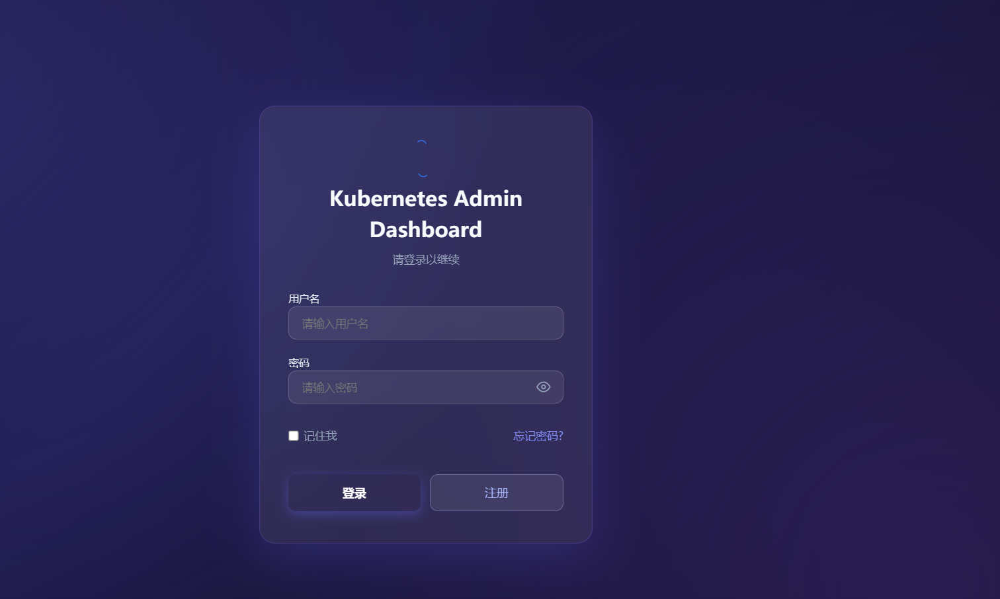
</p>

<p align="center">
  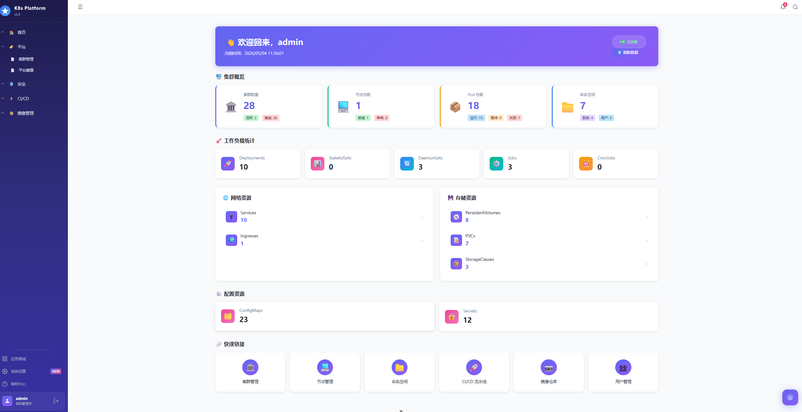
</p>

<p align="center">
  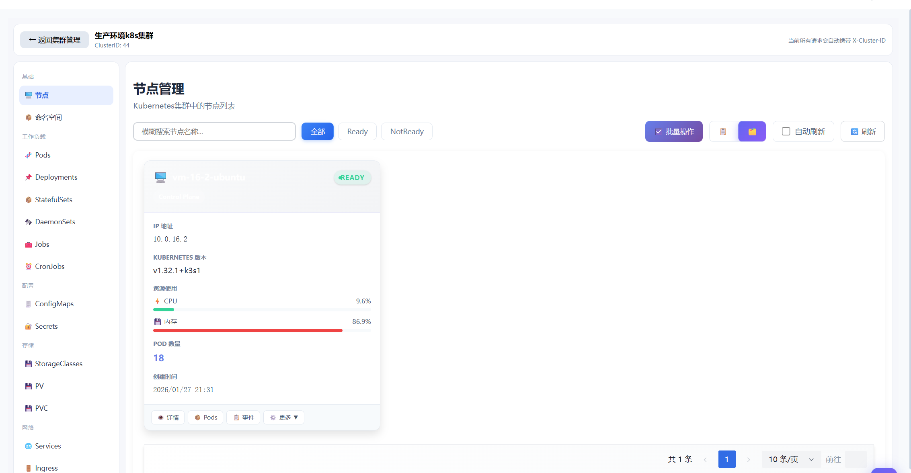
</p>

---

<details>
<summary>📂 点击展开查看全部界面截图 </summary>

<br/>

<p align="center">
  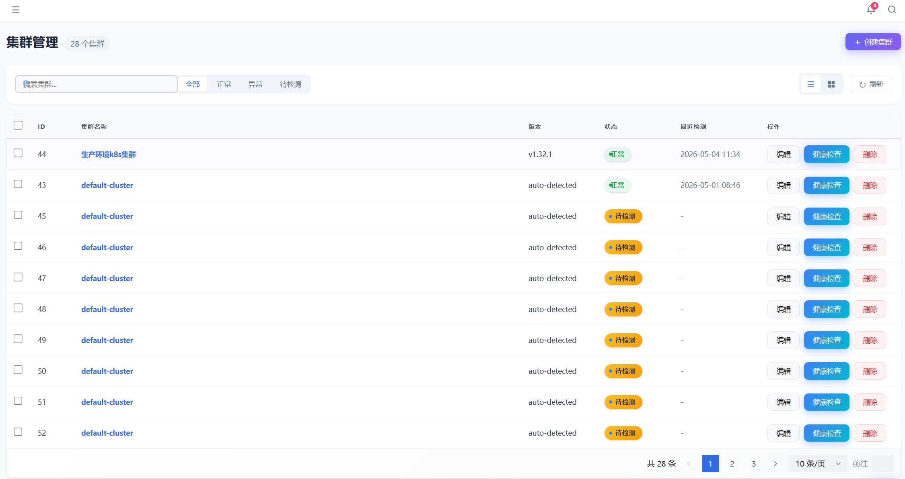
</p>

<p align="center">
  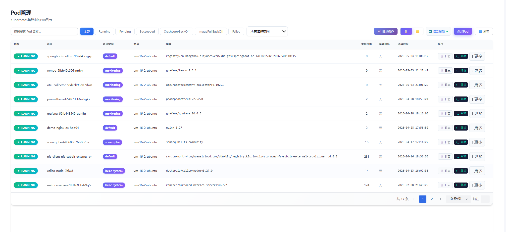
</p>

<p align="center">
  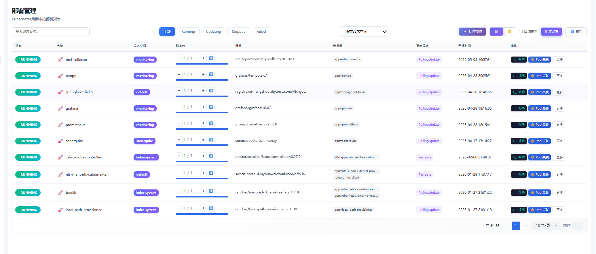
</p>

<p align="center">
  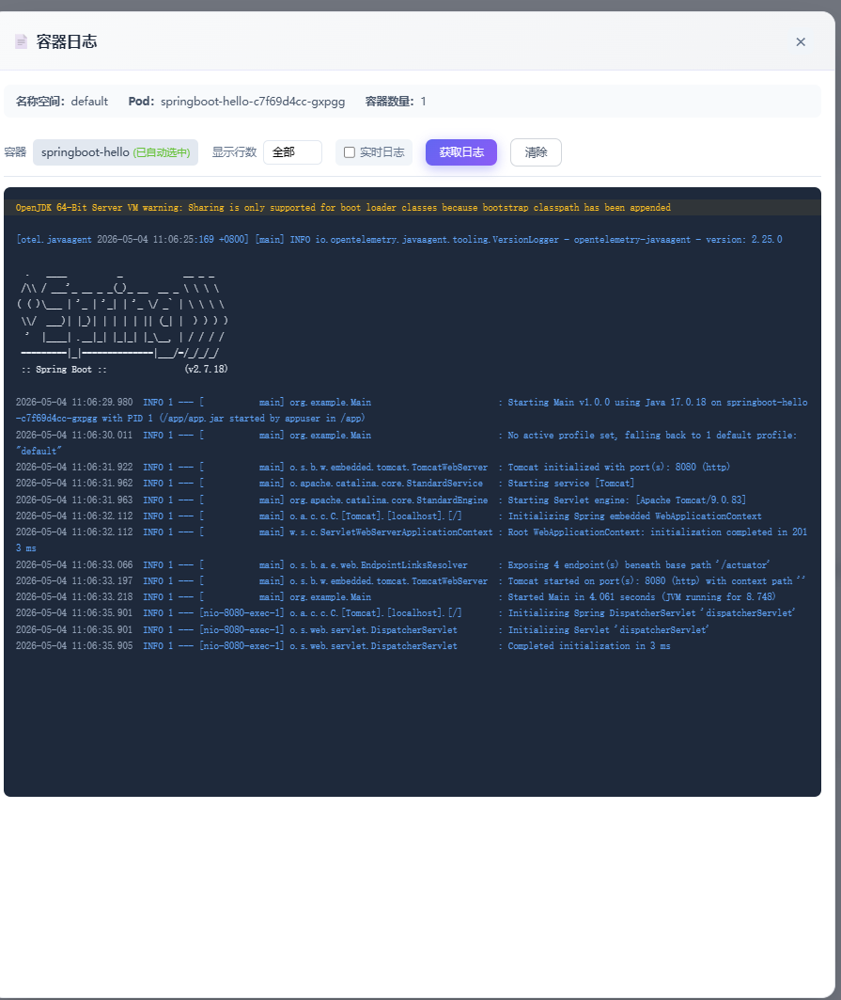
</p>

<p align="center">
  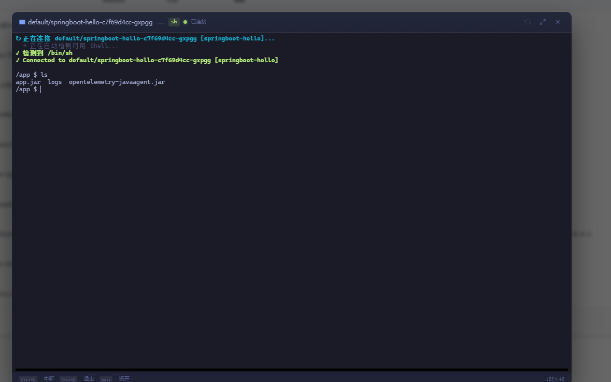
</p>

<p align="center">
  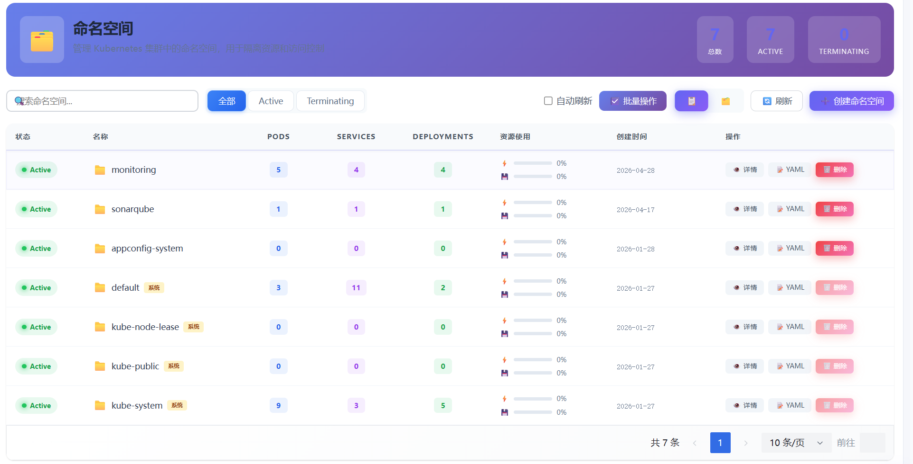
</p>

<p align="center">
  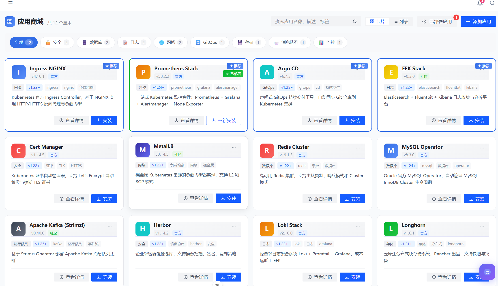
</p>

<p align="center">
  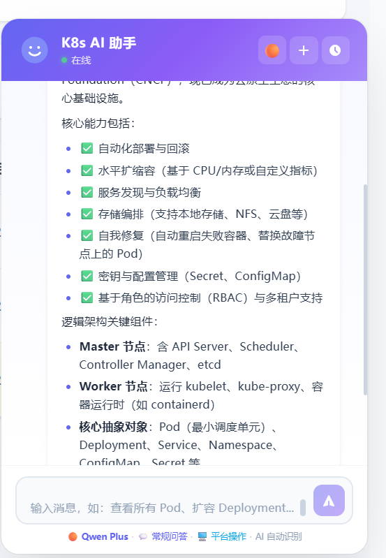
</p>

<p align="center">
  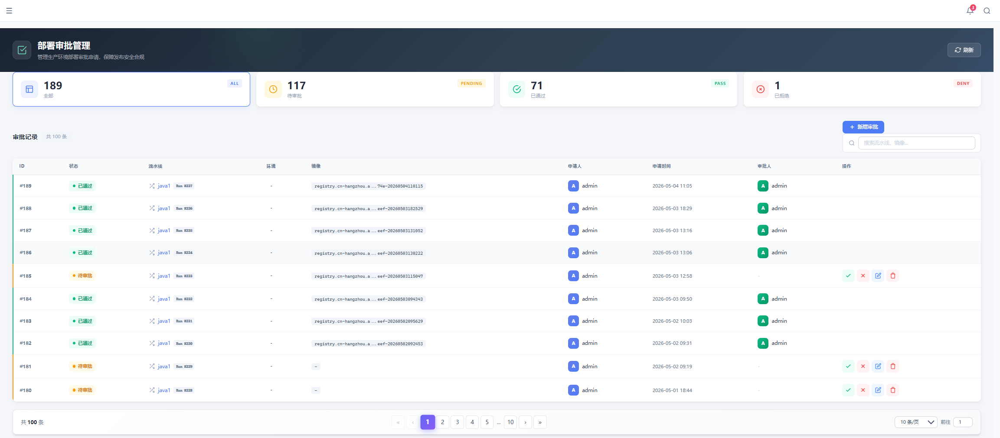
</p>

<p align="center">
  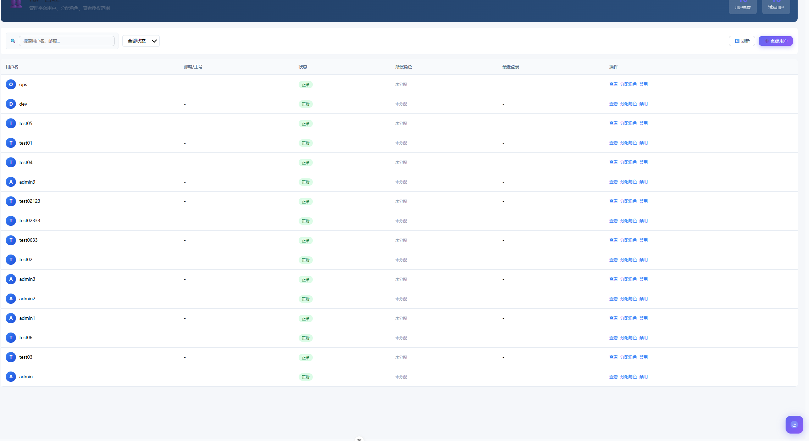
</p>

<p align="center">
  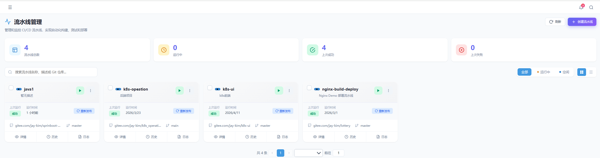
</p>

<p align="center">
  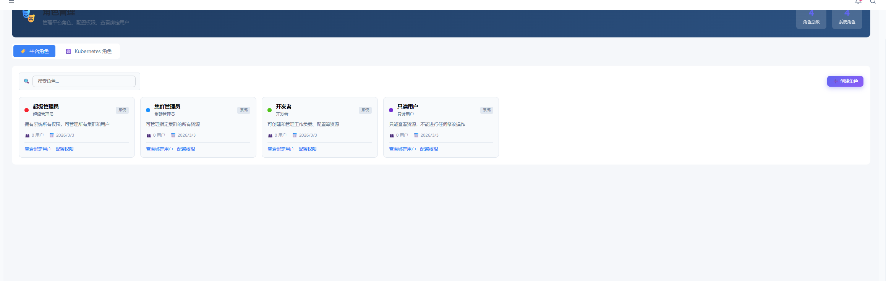
</p>

<p align="center">
  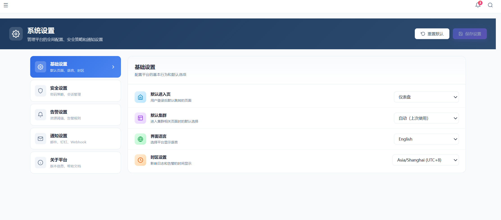
</p>

<p align="center">
  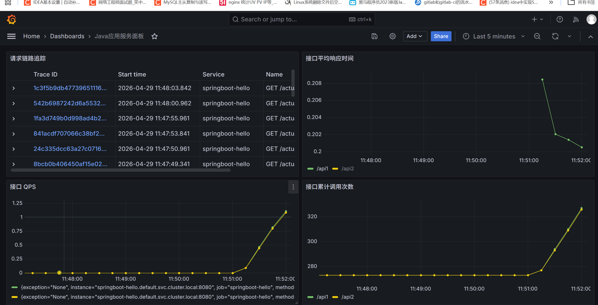
</p>

<p align="center">
  
</p>


<p align="center">
  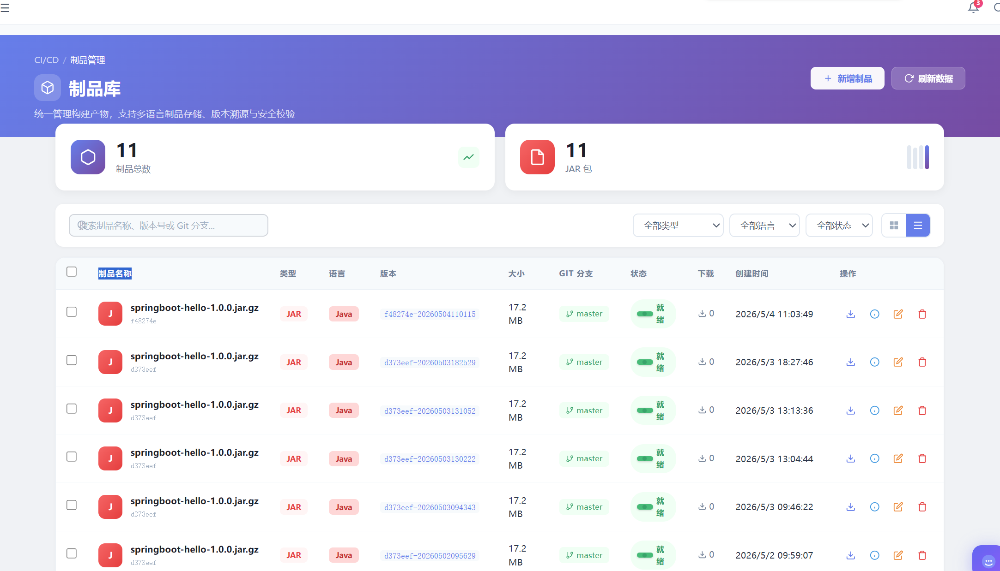
</p>


<p align="center">
  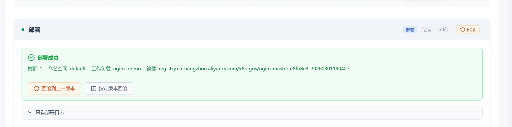
</p>

</details>


## ✨ 核心特性

### 🚦 CI/CD 发布控制（人工审批 / 回滚 / 审计）

平台内置“发布控制平面”，将 CI/CD 从脚本编排升级为 **可控、可追踪、可回滚** 的发布体系。

### 发布流程（建议生产启用）
1. 创建发布单（Release）
2. 触发构建（CI）：Jenkins/GitHub Actions 等（平台与 CI 解耦）
3. 进入待审批（PENDING_APPROVAL）
4. 人工审批通过（APPROVED）后进入部署（DEPLOYING）
5. 滚动更新（RollingUpdate）并持续采集状态
6. 发布成功（SUCCEEDED）或失败（FAILED）
7. 支持一键回滚（ROLLBACKING -> ROLLED_BACK）

### 能力说明
- ✅ 人工审批：审批人/审批时间/审批意见记录，可做权限控制与审计
- ✅ 发布状态机：状态迁移可控，避免“脚本式发布不可追踪”
- ✅ 发布日志：记录构建/部署/回滚全过程关键事件
- ✅ 回滚能力：
    - Deployment：基于 ReplicaSet 历史版本回滚（或指定历史版本）
    - StatefulSet/DaemonSet：基于 ControllerRevision 回滚（按实现情况说明）
- ✅ 发布过程可观测：滚动更新进度、Pod 状态、事件聚合（Backoff、PullError 等）

### 🧩 系统通用能力

- 配置化加载（YAML / ENV）
- JWT 鉴权 + 刷新机制
- Zap 双日志系统（系统日志 / 业务日志）
- Swagger 在线 API 文档（支持 Standalone）
- 健康检查与优雅关闭
- 标准化控制器 / 服务 / DAO 分层
- 全局异常拦截（中间件）

------

## ☸ Kubernetes 高级能力（全部已实现）

### Deployment 管理

- CRUD、扩缩容、镜像更新、滚动升级
- 滚动重启、基于 ReplicaSet 的版本回滚
- Pods 列表、事件聚合、历史版本查询

### Pod 管理

- 列表、详情、日志（流式/非流）
- 镜像 Patch、事件查询、强制删除

### StatefulSet / DaemonSet

- CRUD、扩缩容、镜像更新
- ControllerRevision 回滚

### Service / Ingress

- CRUD
- Strategic / JSON Merge Patch
- TLS 配置、事件聚合

### Job / CronJob

- Job：创建 / 删除 / 状态查询
- CronJob：启停、删除、历史 Job 查询

### Secret / PVC / PV / ConfigMap / StorageClass

- 全生命周期管理
- PVC 扩容、PV ReclaimPolicy 修改
- ConfigMap Patch、StorageClass CRUD

### Node 高级管理

- Cordon / Uncordon
- Drain（驱逐可驱逐 Pod）
- Pod Evict（支持 gracePeriod）
- 节点 Metrics、Pods 列表

### Event 事件聚合

- Pod / Deploy / StatefulSet / Node 等资源
- 支持排障快速定位（Backoff、PullError、Unschedulable）

------

## 🧩 多集群管理

- 动态添加/切换多个 K8s 集群
- **kubeconfig 加密存储**（AES-256-GCM）
- TLS 证书动态信任（解决 x509 证书问题）
- 连通性检测与健康状态监控
- 多集群 clientset 连接池管理

适合企业多集群统一管控场景。

------

## 💡 技术亮点

### 1. 敏感数据加密存储

```go
// kubeconfig 使用 AES-256-GCM 加密
// 数据库存储格式：ENC:base64(nonce+ciphertext)
func EncryptKubeConfig(plain, key string) string {
    // AEAD 加密，防篡改，安全性高
}
```

### 2. 统一错误码体系

```go
// 前端可根据错误码精准处理不同场景
var (
    InvalidParams    = NewError(10001, "参数错误")
    Unauthorized     = NewError(10002, "认证失败")
    ClusterNotFound  = NewError(20001, "集群不存在")
    PermissionDenied = NewError(20002, "权限不足")
)
```

### 3. K8s 客户端连接池

```go
// 多集群场景，每个集群维护独立 clientset
// 支持动态切换，避免重复创建连接
type ClusterClientManager struct {
    clients sync.Map // clusterId -> *kubernetes.Clientset
}
```

### 4. 配置热更新

```
系统设置存储在数据库，修改后立即生效
├── 基础设置（默认页面、语言、时区）
├── 安全设置（会话超时、密码策略）
├── 告警设置（CPU/内存/磁盘阈值）
└── 通知设置（邮件/钉钉/Webhook）
```

------

## 💡 项目难点与解决方案

| 难点 | 解决方案 |
|------|----------|
| 多集群 TLS 证书信任 | 解析 kubeconfig 中的 CA，动态构建 TLS Config |
| 权限隔离粒度细 | 三层模型 + 前后端双重校验 |
| 配置热更新 | 数据库存储 + 内存缓存，修改后立即生效 |
| 空集群启动 | 降级策略，无集群时跳过 K8s 初始化 |
| 错误码统一 | 全局错误码体系 + 中间件统一处理 |
| 前后端类型一致性 | DAO 层强制返回空切片而非 nil |

------


------

## 📈 项目收益

通过这个平台，运维团队可以：

- **效率提升**：多集群统一管理，减少 80% 切换成本
- **安全合规**：细粒度权限隔离，满足审计要求
- **降低门槛**：开发人员无需学习 kubectl，可视化操作

------

## 📦 项目结构（真实仓库对应）

```bash
k8soperation/
├── cmd/
├── configs/
├── docs/
│   ├── 📄 K8sOperation 后台系统部署文档.md   <--（部署文档）
├── global/
├── initialize/
├── internal/
│   ├── app/
│   ├── errorcode/
│   ├── health/
│   └── k8soperation/
├── pkg/
├── build/
└── storage/
```

------

## ⚙️ 快速启动

### 1️⃣ 克隆仓库

```bash
git clone https://gitee.com/jay-kim/k8s_operation.git
cd k8s_operation
```

### 2️⃣ 数据库初始化

```bash
# 数据库要求：MySQL 8.0+，字符集 utf8mb4
mysql -h 127.0.0.1 -u root -p < docs/sql/k8s-platform.sql
```

### 3️⃣ 启动后端

```bash
make build
./bin/k8soperation
```

### 4️⃣ 启动前端

```bash
cd k8s-web
npm install
npm run dev
```

### 5️⃣ 访问系统

- 前端界面：`http://localhost:5173`
- Swagger API：`http://localhost:8080/swagger`
- 默认账号：`admin / admin123`

------

## 📄 部署文档（强烈推荐阅读）

官方部署说明文档（包括 **后端服务** 与 **前端管理界面** 的部署方式）：

👉 **K8sOperation 后台系统部署文档（后端）**  
https://gitee.com/jay-kim/k8s_operation/blob/master/docs/📄%20K8sOperation%20后台系统部署文档.md

👉 **前端管理系统部署文档（k8s-web）**  
https://gitee.com/jay-kim/k8s_operation/blob/master/docs/%E5%89%8D%E7%AB%AF%E7%AE%A1%E7%90%86%E7%B3%BB%E7%BB%9F%E9%83%A8%E7%BD%B2%E6%96%87%E6%A1%A3.md

---

### 后端部署文档内容包括：

- 构建后端二进制
- Docker / Containerd 镜像构建
- 使用 Systemd 管理服务
- Kubernetes Deployment / Service 部署示例
- 参数说明与优化建议
- 生产环境目录规划

---

### 前端部署文档内容包括：

- 前端项目构建（Vite）
- 环境变量配置（API_BASE）
- Nginx 部署（SPA 路由支持）
- Docker 部署
- Kubernetes（Deployment / Service / Ingress）
- 与后端 API 对接说明

## 🔗 关联项目（推荐配套使用）

### 📘 AppConfig Operator

（Kubebuilder 开发，用于管理自定义资源 AppConfig）
👉 https://gitee.com/jay-kim/appconfig-operator

Operator → 管理 AppConfig CRD
k8soperation → 提供 HTTP API/Web 后台

两者解耦，便于独立演进。

------

## ⭐ Star / Watch / Fork

如果本项目对你有帮助，非常欢迎：

- ⭐ **Star**
- 👀 **Watch**
- 🍴 **Fork**

你的支持是我持续完善的最大动力！

------

## 📜 License

Apache-2.0