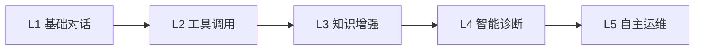

# AI 能力演进路线图

> 版本: v1.0 | 更新时间: 2026-04-13

## 一、AI 能力成熟度模型



| 等级 | 名称 | 能力描述 | 状态 |
|------|------|---------|------|
| **L1** | 基础对话 | 通用问答、K8s 知识咨询、流式 SSE | ✅ 已实现 |
| **L2** | 工具调用 | Function Calling、40+ 工具、意图识别、审批流 | ✅ 已实现 |
| **L3** | 知识增强 | RAG 知识库、内部文档检索、精准回答 | 🔮 规划中 |
| **L4** | 智能诊断 | 监控联动、异常自动分析、排障建议 | 🔮 规划中 |
| **L5** | 自主运维 | AI Agent 多步推理、自动修复、预测性运维 | 💡 远期 |

## 二、能力演进详细路线

### Phase 1: 当前已实现 (L1 + L2)

```
✅ 多模型热切换（OpenAI/DeepSeek/通义千问/智谱/NVIDIA NIM/Moonshot）
✅ 三类对话模式（通用问答 / 平台操作 / 高危审批）
✅ Function Calling（40+ 工具，覆盖全部 K8s 资源）
✅ 智能路由（needToolCalling 关键词预判，跳过闲聊降低延迟）
✅ 工具智能筛选（selectRelevantTools 按意图发送相关工具子集）
✅ 风险分级审批（read/write/danger/critical 四级）
✅ 会话管理（多轮对话、历史上下文）
✅ 流式 SSE 输出
✅ 意图分析接口
✅ AI 专属日志系统
```

### Phase 2: 知识增强 (L3) - 预计 5-7 天

```
目标：AI 助手具备「组织记忆」，回答基于真实内部文档

┌─────────────────────────────────────────────────┐
│ 2.1 基础 RAG 能力                                │
│   ├── 文档上传 → 自动分片 → Embedding → 向量入库  │
│   ├── 对话时自动检索 Top-K 相关片段注入 Prompt     │
│   └── 支持 Markdown / TXT / PDF                  │
├─────────────────────────────────────────────────┤
│ 2.2 知识库管理前端                                │
│   ├── 文档 CRUD + 分类标签                        │
│   ├── 分片预览 + 手动编辑                         │
│   └── 检索测试（输入问题查看命中片段）              │
├─────────────────────────────────────────────────┤
│ 2.3 自动知识积累                                  │
│   ├── 集群重要事件自动入库                         │
│   ├── 告警处理记录自动入库                         │
│   └── AI 对话中高价值 QA 对自动标记入库            │
└─────────────────────────────────────────────────┘
```

### Phase 3: 监控联动 + 智能诊断 (L4) - 预计 5-8 天

```
目标：AI 助手能主动感知异常，提供诊断分析和修复建议

┌─────────────────────────────────────────────────┐
│ 3.1 监控数据接入                                  │
│   ├── Prometheus 指标查询                         │
│   ├── 资源使用趋势分析                             │
│   └── 告警事件关联                                │
├─────────────────────────────────────────────────┤
│ 3.2 智能诊断工具                                  │
│   ├── diagnose_pod: Pod 异常综合诊断               │
│   │   → 状态 + 事件 + 日志 + 指标 → AI 分析       │
│   ├── diagnose_node: 节点异常诊断                  │
│   │   → 资源 + 条件 + 污点 + 指标 → AI 分析       │
│   └── diagnose_deployment: 部署异常诊断            │
│       → 副本状态 + 事件 + Pod状况 → AI 分析        │
├─────────────────────────────────────────────────┤
│ 3.3 诊断流程示例                                  │
│                                                   │
│   用户: "nginx-pod 为什么一直重启?"                │
│   ┌──────────────────────────────────────┐       │
│   │ Step 1: get_pod_detail(nginx-pod)    │       │
│   │ Step 2: get_pod_logs(nginx-pod)      │       │
│   │ Step 3: query_metrics(container_     │       │
│   │         memory_usage, 1h)            │       │
│   │ Step 4: get_events(nginx-pod)        │       │
│   │ Step 5: search_knowledge(OOM重启)    │       │
│   └──────────────────────────────────────┘       │
│   AI: "根据分析，该 Pod 在过去1小时内因 OOM       │
│   被 kill 了3次。容器内存 limit 为 128Mi，       │
│   实际峰值达 156Mi。建议将 memory limit          │
│   调整为 256Mi。知识库中有类似案例：[链接]"        │
└─────────────────────────────────────────────────┘
```

### Phase 4: AI Agent 自主运维 (L5) - 远期

```
目标：从「被动回答」到「主动运维」的 AI Agent

┌─────────────────────────────────────────────────┐
│ 4.1 多步推理（ReAct 模式）                        │
│   ├── AI 自动规划执行步骤                          │
│   ├── 执行 → 观察 → 推理 → 下一步                 │
│   └── 每步写操作仍需审批（安全兜底）                │
├─────────────────────────────────────────────────┤
│ 4.2 预测性运维                                    │
│   ├── 基于历史数据预测资源瓶颈                     │
│   ├── 自动生成扩容建议                             │
│   └── 趋势告警（指标趋势异常预警）                  │
├─────────────────────────────────────────────────┤
│ 4.3 自动修复工作流                                │
│   ├── 告警触发 → AI 分析 → 生成修复方案            │
│   ├── 低风险自动执行（如重启 Pod）                  │
│   ├── 高风险生成审批单等待确认                      │
│   └── 修复后自动验证 + 记录案例                    │
├─────────────────────────────────────────────────┤
│ 4.4 ChatOps 集成                                 │
│   ├── 钉钉/企微/Slack 机器人对接                   │
│   ├── 在群里直接 @AI助手 操作集群                   │
│   └── 告警 → 群通知 → 群内直接处理                 │
└─────────────────────────────────────────────────┘
```

## 三、技术架构演进

```mermaid
graph TB
    subgraph Current["当前架构 (L1+L2)"]
        User1[用户] --> AI1[AI 对话]
        AI1 --> FC1[Function Calling]
        FC1 --> K8s1[K8s API]
        FC1 --> Approval1[审批引擎]
    end

    subgraph Phase2["Phase 2 (L3)"]
        User2[用户] --> AI2[AI 对话]
        AI2 --> RAG2[RAG 检索]
        RAG2 --> VDB2[(向量DB)]
        AI2 --> FC2[Function Calling]
    end

    subgraph Phase3["Phase 3 (L4)"]
        User3[用户] --> AI3[AI 对话]
        Monitor3[监控告警] --> AI3
        AI3 --> Diagnose3[智能诊断引擎]
        Diagnose3 --> K8s3[K8s + Prometheus]
        Diagnose3 --> RAG3[RAG 故障案例]
    end

    subgraph Phase4["Phase 4 (L5)"]
        Alert4[告警触发] --> Agent4[AI Agent]
        Agent4 --> Plan4[自动规划]
        Plan4 --> Execute4[分步执行]
        Execute4 --> Verify4[自动验证]
        Verify4 --> Record4[案例入库]
    end
```



## 四、每阶段新增文件清单

### Phase 2 (RAG) 新增文件

```
后端:
  pkg/embedding/embedding.go           # Embedding 客户端
  pkg/vectordb/vectordb.go             # 向量DB接口
  pkg/vectordb/mysql_fulltext.go       # MySQL全文检索实现
  pkg/vectordb/milvus.go               # Milvus实现（后续）
  internal/app/services/rag_knowledge.go  # 知识管理
  internal/app/services/rag_retrieval.go  # RAG检索
  internal/app/models/knowledge.go     # 知识模型
  internal/app/dao/knowledge_dao.go    # 知识DAO
  internal/app/routers/knowledge/      # 知识API路由
  
前端:
  k8s-web/src/views/knowledge/KnowledgeList.vue    # 文档列表
  k8s-web/src/views/knowledge/KnowledgeUpload.vue  # 上传页
  k8s-web/src/api/knowledge.js                     # API封装
  
改动:
  internal/app/services/ai_assistant.go  # +RAG检索步骤
  internal/app/services/ai_tools.go      # +search_knowledge工具
  configs/config.yaml                    # +RAG配置段
```

### Phase 3 (监控) 新增文件

```
后端:
  pkg/prometheus/client.go             # Prometheus客户端
  internal/app/services/monitoring.go  # 监控Service
  internal/app/services/monitoring_alert.go # 告警Service
  internal/app/models/monitor.go       # 监控模型
  internal/app/dao/monitor_dao.go      # 监控DAO
  internal/app/routers/monitoring/     # 监控API路由
  internal/app/worker/alert_checker.go # 告警检查Worker
  
前端:
  k8s-web/src/views/monitoring/Dashboard.vue    # 监控仪表盘
  k8s-web/src/views/monitoring/NodeMetrics.vue  # 节点监控
  k8s-web/src/views/monitoring/Alerts.vue       # 告警管理
  k8s-web/src/views/monitoring/Rules.vue        # 告警规则
  k8s-web/src/api/monitoring.js                 # API封装
  
改动:
  internal/app/services/ai_tools.go      # +监控工具
  internal/app/services/ai_executor.go   # +监控工具执行
  configs/config.yaml                    # +Monitoring配置段
```

## 五、AI 助手工具扩展规划

### 当前工具 (40+)

| 类别 | 工具数 | 示例 |
|------|--------|------|
| 查询类 | 23 | list_pods, get_deployment_detail, list_clusters |
| 写操作 | 12 | scale_deployment, create_configmap, trigger_pipeline |
| 高危操作 | 11 | delete_pod, delete_namespace, drain_node |

### Phase 2 新增 (RAG)

| 工具 | 风险 | 说明 |
|------|------|------|
| search_knowledge | read | 搜索知识库文档 |
| index_document | write | 手动索引文档（需审批） |

### Phase 3 新增 (监控)

| 工具 | 风险 | 说明 |
|------|------|------|
| query_metrics | read | 查询资源监控指标 |
| get_alerts | read | 获取当前告警列表 |
| get_resource_trend | read | 查看资源使用趋势 |
| diagnose_pod | read | Pod 异常综合诊断 |
| diagnose_node | read | 节点异常综合诊断 |
| create_alert_rule | write | 创建告警规则 |

### Phase 4 新增 (Agent)

| 工具 | 风险 | 说明 |
|------|------|------|
| auto_diagnose | read | 自动多步诊断 |
| generate_fix_plan | read | 生成修复方案 |
| execute_fix | danger | 执行修复（强制审批） |
| predict_capacity | read | 容量预测 |

## 六、依赖与技术选型

### Phase 2 新增依赖

```go
// go.mod 新增
github.com/milvus-io/milvus-sdk-go/v2  // Milvus 客户端（可选）
github.com/pgvector/pgvector-go         // pgvector（可选）
github.com/ledongthuc/pdf               // PDF 解析（可选）
```

### Phase 3 新增依赖

```go
// go.mod 新增
github.com/prometheus/client_golang      // Prometheus 客户端
github.com/prometheus/common/model       // Prometheus 数据模型
```

### 前端新增依赖

```json
// package.json 新增
{
  "echarts": "^5.5.0",        // 图表库（监控仪表盘）
  "vue-echarts": "^7.0.0",    // Vue3 ECharts 组件
  "marked": "^12.0.0"         // Markdown 渲染（知识库预览）
}
```

## 七、风险与注意事项

| 风险 | 影响 | 应对措施 |
|------|------|---------|
| 向量数据库引入增加运维复杂度 | 中 | 初期用 MySQL 全文检索，验证后再升级 |
| Embedding API 调用成本 | 低 | 批量处理、缓存已索引文档 |
| RAG 检索质量不佳 | 中 | 分片策略调优、重排序、混合检索 |
| Prometheus 查询性能 | 中 | 限制查询时间范围、缓存常用指标 |
| AI Agent 自动操作安全性 | 高 | 严格审批流、操作回滚、人工确认 |
| 多模型 Embedding 不兼容 | 低 | 统一使用一个 Embedding 模型 |

## 八、总结

当前平台的 AI 架构设计**扩展性优秀**：

1. **模块化**：Router → Controller → Service → DAO 分层，新增模块互不干扰
2. **插件式工具**：`toolRegistry` 注册制，新增 AI 工具只需 3 步（注册 → 定义 → 实现）
3. **多模型抽象**：`Registry` 提供商注册中心，天然支持新增 Embedding 模型
4. **配置驱动**：所有新功能通过 `config.yaml` 开关控制，灰度友好
5. **前端按需加载**：Vue3 路由懒加载，新增页面零侵入

> 建议优先实施 **Phase 2 (RAG)**，因为它能最直接提升 AI 助手的实用价值，且改动量最小（核心只改 `ai_assistant.go` 一个文件）。
