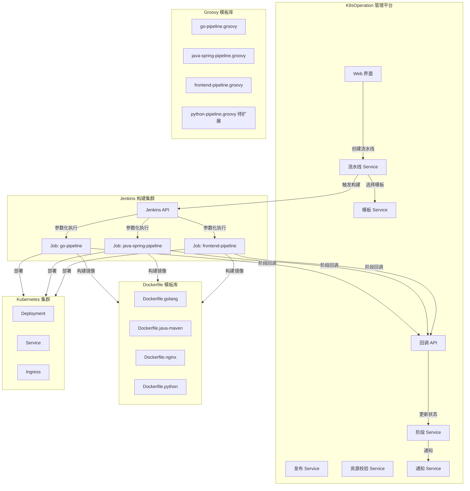

# CI/CD 发布与模板化架构设计文档

> 面试参考 | 版本: v2.0 | 更新时间: 2026-04-13
> 
> 本文档梳理平台 CI/CD 模块的核心架构设计思路，适用于面试中「如何实现应用发布」「100 个项目如何复用」等问题的回答。

---

## 一、面试核心回答框架

**问：你这个项目怎么发布新的应用？**

> 我们平台采用 **"Groovy 模板 + 参数化驱动 + 回调闭环"** 的架构。核心思路是：
> 
> 1. **模板复用**：按语言类型预定义 Groovy Pipeline 模板（Go/Java/Nginx/Python），每个模板定义标准化的构建阶段
> 2. **参数化驱动**：所有项目差异（仓库地址、分支、镜像名、部署目标等）全部通过参数传入，模板本身不包含任何项目特定信息
> 3. **平台编排**：用户在平台 Web 界面创建流水线，选择模板、填写参数，平台通过 Jenkins API 触发构建
> 4. **回调闭环**：Jenkins 构建过程中通过 HTTP 回调实时上报阶段状态，平台展示实时进度并发送通知
> 
> 这样设计的好处是：**100 个项目只需要 3-4 个模板**，新项目接入只需在平台填写参数即可，零 Groovy 编写成本。

---

## 二、整体架构



## 三、Groovy 模板设计（核心）

### 3.1 设计原则

| 原则 | 说明 | 举例 |
|------|------|------|
| **模板与项目解耦** | 模板不包含任何项目特定信息 | 仓库地址、分支、镜像名全部通过 `params` 传入 |
| **参数化一切** | 所有差异点都是参数 | `APP_NAME`, `GIT_REPO`, `IMAGE_TAG`, `K8S_NAMESPACE` 等 |
| **阶段标准化** | 所有语言遵循统一阶段流程 | Checkout → Install → Lint → Test → Build → Push → Deploy → Health Check |
| **回调驱动** | 每个阶段实时回调平台 | `notifyStage('build', 'success')` |
| **容错降级** | 没有 Dockerfile 时自动生成默认的 | 模板内 `if [ ! -f Dockerfile ]; then ...` |

### 3.2 统一参数规范

**所有模板都接收相同的基础参数**，这是 100 个项目复用的关键：

```groovy
parameters {
    // === 平台对接参数 ===
    string(name: 'PLATFORM_API_URL')    // 平台 API 地址（用于回调）
    string(name: 'RELEASE_ID')          // 发布单 ID
    
    // === 项目参数 ===
    string(name: 'APP_NAME')            // 应用名称
    string(name: 'GIT_REPO')            // Git 仓库地址
    string(name: 'GIT_BRANCH')          // Git 分支
    
    // === 镜像参数 ===
    string(name: 'IMAGE_REGISTRY')      // 镜像仓库地址
    string(name: 'IMAGE_NAME')          // 镜像名称
    string(name: 'IMAGE_TAG')           // 镜像标签
    
    // === 部署参数 ===
    string(name: 'K8S_NAMESPACE')       // K8s 命名空间
    string(name: 'K8S_DEPLOYMENT')      // Deployment 名称
    string(name: 'REPLICAS')            // 副本数
    
    // === 语言特定参数 ===
    string(name: 'GO_VERSION')          // Go 模板专有
    string(name: 'JAVA_VERSION')        // Java 模板专有
    string(name: 'NODE_VERSION')        // 前端模板专有
}
```

### 3.3 已有模板清单

| 模板 | 文件 | 适用场景 | 特殊阶段 |
|------|------|---------|---------|
| **Go Pipeline** | `go-pipeline.groovy` | Go Web/微服务/CLI | `go mod download` → `golangci-lint` → `go test -race` → `go build -ldflags` |
| **Java Spring** | `java-spring-pipeline.groovy` | Spring Boot/Cloud | `mvn compile` → `mvn test` + JUnit → SonarQube(可选) → `mvn package` |
| **Frontend** | `frontend-pipeline.groovy` | Vue/React/Angular | `npm ci` → `npm run lint` → `npm test` → `npm run build` |
| **Python** | 待扩展 | Flask/FastAPI/Django | `pip install` → `pytest` → `gunicorn/uvicorn` |

### 3.4 各语言构建差异对比

```
                Go            Java           Frontend        Python
─────────────────────────────────────────────────────────────────
依赖安装     go mod download  mvn compile    npm ci          pip install
代码检查     golangci-lint    SonarQube      eslint          flake8/ruff
单元测试     go test -race    mvn test       npm test        pytest
构建产物     二进制文件        JAR 包         dist/ 目录      无(源码部署)
基础镜像     alpine:3.18      temurin-jre    nginx:alpine    python:slim
产物大小     ~10-30MB         ~50-200MB      ~5-20MB         ~100-500MB
健康检查     /healthz/live    /actuator/health  /health      /health
```

### 3.5 回调闭环机制

```groovy
// 每个阶段开始和结束时回调平台
def notifyStage(String stageName, String status) {
    httpRequest(
        url: "${PLATFORM_API_URL}/api/v1/k8s/cicd/release/stage/callback",
        httpMode: 'POST',
        requestBody: groovy.json.JsonOutput.toJson([
            release_id: env.RELEASE_ID.toLong(),
            stage: stageName,          // checkout/build/test/deploy/...
            status: status,            // running/success/failed
            started_at: ...,
            finished_at: ...
        ])
    )
}
```

**回调时序图：**

```
平台                    Jenkins                 K8s
 │                        │                      │
 │──触发构建(参数)──────→ │                      │
 │                        │──Checkout ──────────→│
 │←──callback(checkout,   │                      │
 │   running)             │                      │
 │←──callback(checkout,   │                      │
 │   success)             │                      │
 │                        │──Build ─────────────→│
 │←──callback(build,      │                      │
 │   running)             │                      │
 │←──callback(build,      │                      │
 │   success)             │                      │
 │                        │──Push Image ────────→│
 │←──callback(push,       │                      │
 │   success)             │                      │
 │                        │──Deploy ────────────→│──kubectl set image──→
 │←──callback(deploy,     │                      │←─rollout status──────
 │   success)             │                      │
 │                        │──Health Check ──────→│──get pods ──────────→
 │←──callback(health,     │                      │
 │   success)             │                      │
 │←──notifyBuild(         │                      │
 │   success)             │                      │
 │──发送钉钉通知 ────→    │                      │
```

## 四、平台后端架构

### 4.1 核心服务分层

```
cicd_pipeline.go      # 流水线 CRUD + 触发运行 + Jenkins 交互
cicd_template.go      # 模板 CRUD（模板库管理）
cicd_stage.go         # 10 个标准阶段（含审批+部署）+ 阶段回调处理
cicd_release.go       # 发布单管理（幂等创建 + 状态机 + 多集群任务）
cicd_resource.go      # 资源配置校验（CPU/内存/副本数规则）
cicd_notify.go        # 钉钉通知（构建开始/成功/失败）
cicd_environment.go   # 多环境管理（dev/staging/prod）
cicd_executor.go      # 部署执行器（调用 client-go 滚动更新）
cicd_git.go           # Git 仓库操作
```

### 4.2 10 阶段标准化流水线

```go
var DefaultStageDefinitions = []StageDefinition{
    {Order: 1,  Type: "clean",        Name: "清理工作空间", Enabled: true},
    {Order: 2,  Type: "checkout",     Name: "代码检出",     Enabled: true},
    {Order: 3,  Type: "dependencies", Name: "依赖下载",     Enabled: true},
    {Order: 4,  Type: "compile",      Name: "编译检查",     Enabled: true},
    {Order: 5,  Type: "test",         Name: "单元测试",     Enabled: true},
    {Order: 6,  Type: "lint",         Name: "代码检查",     Enabled: true},
    {Order: 7,  Type: "build",        Name: "构建镜像",     Enabled: true},
    {Order: 8,  Type: "push",         Name: "推送镜像",     Enabled: true},
    {Order: 9,  Type: "approval",     Name: "人工审批",     Enabled: false}, // 按需
    {Order: 10, Type: "deploy",       Name: "部署",         Enabled: false}, // 按需
}
```

### 4.3 发布状态机

```
             ┌──────────────────────────────────┐
             │                                  │
             ▼                                  │
  Pending → Queued → Running → Success          │
                        │                       │
                        ├──→ Failed ────────────┘ (可重试)
                        │
                        └──→ Canceled
```

### 4.4 幂等与安全设计

```go
// 幂等控制：相同 request_id 不会重复创建发布单
if reqID != "" {
    exist, err := s.dao.CicdReleaseGetByRequestID(ctx, reqID)
    if err == nil && exist != nil {
        return exist.ID, nil  // 直接返回已有记录
    }
}

// HMAC 签名验证：防止伪造回调
func computeHMAC(payload []byte) string {
    mac := hmac.New(sha256.New, []byte(global.JenkinsSetting.HMACSecret))
    mac.Write(payload)
    return hex.EncodeToString(mac.Sum(nil))
}
```

## 五、100 个项目如何复用（面试重点）

### 5.1 架构设计思路

```
传统方式（每个项目一个 Jenkinsfile）:
├── project-a/Jenkinsfile    ← 300 行 Groovy
├── project-b/Jenkinsfile    ← 300 行 Groovy（大部分重复）
├── project-c/Jenkinsfile    ← 300 行 Groovy（大部分重复）
└── ... × 100 个项目 = 30000 行维护噩梦

我们的方式（模板 + 参数化）:
├── templates/
│   ├── go-pipeline.groovy       ← 1 个 Go 模板（374 行）
│   ├── java-spring-pipeline.groovy ← 1 个 Java 模板（372 行）
│   └── frontend-pipeline.groovy    ← 1 个前端模板（309 行）
└── 100 个项目 → 每个只需一条 "流水线配置记录"（存数据库，10 个字段）
```

### 5.2 新项目接入流程（3 分钟）

```
Step 1: 在平台 Web 界面点击「创建流水线」
Step 2: 填写参数:
   - 名称: my-service
   - Git 仓库: https://github.com/company/my-service.git
   - 分支: main
   - Jenkins Job: go-pipeline  ← 选择对应语言的模板 Job
   - 镜像仓库: registry.example.com/my-service
   - 部署目标: cluster-1 / namespace-prod / my-service
Step 3: 点击「运行」，平台自动:
   ├── 调用 Jenkins API 触发 go-pipeline Job
   ├── 传入参数 (APP_NAME=my-service, GIT_REPO=..., ...)
   ├── Jenkins 执行模板化 Pipeline
   ├── 实时回调阶段状态
   └── 构建完成后钉钉通知
```

### 5.3 复用矩阵

```
                    Go 模板        Java 模板       前端模板
────────────────────────────────────────────────────────
user-service          ✓
order-service         ✓
payment-gateway                      ✓
auth-service                         ✓
admin-web                                           ✓
customer-app                                        ✓
data-processor        ✓
...                   ✓              ✓              ✓
────────────────────────────────────────────────────────
共计:               30 个项目      40 个项目       30 个项目
模板数:               1              1               1
```

> **100 个项目，只需 3 个模板**。维护 ~1000 行 Groovy，而非 30000 行。

### 5.4 Dockerfile 模板复用

同样的模板化思路应用于 Dockerfile：

| 语言 | 模板 | 特点 |
|------|------|------|
| Go | `Dockerfile.golang` | 多阶段构建，产物仅 10-30MB，alpine 基础 |
| Java | `Dockerfile.java-maven` | Maven 构建 + JRE 运行，支持 JVM 调优 |
| Nginx | `Dockerfile.nginx` | 前端静态文件 + 自定义 nginx.conf |
| Python | `Dockerfile.python` | slim 基础 + pip 依赖 + 非 root 用户 |

**共性设计（所有 Dockerfile 都遵循）：**
- 多阶段构建（减小镜像体积）
- 非 root 用户运行（安全）
- HEALTHCHECK 指令（健康检查）
- 时区设置 Asia/Shanghai
- 依赖缓存优化（先 COPY 依赖文件，再 COPY 源码）

## 六、资源校验与风险控制

### 6.1 环境资源规则引擎

```go
// 按环境 + 语言类型定义资源上下限
rule := CicdEnvResourceRule{
    Env:             "prod",
    ServiceType:     "java",
    CPULimitMax:     "4",        // 生产环境 Java 服务 CPU 上限 4 核
    MemoryLimitMax:  "8Gi",      // 内存上限 8Gi
    ReplicasMin:     2,          // 至少 2 副本（高可用）
    ReplicasMax:     20,         // 最多 20 副本
    RequireApproval: true,       // 生产环境必须审批
    ApprovalRole:    "sre",
}
```

### 6.2 智能风险提示

```go
// 生产环境单副本 → 高风险
if env == "prod" && replicas == 1 {
    warning: "生产环境仅1副本，存在高可用风险"
}

// Java 服务内存过小 → OOM 风险
if serviceType == "java" && memoryLimit < 1Gi {
    warning: "Java服务内存limit小于1Gi，存在OOM风险"
}

// 生产环境未启用 HPA → 提示
if env == "prod" && !hpa.enabled {
    warning: "生产环境建议启用HPA自动伸缩"
}
```

## 七、多集群部署

### 7.1 发布单 → 多集群任务

```go
// 一个发布单可以部署到多个集群
release := CicdRelease{
    AppName:      "user-service",
    ImageRepo:    "registry.example.com/user-service",
    ImageTag:     "v1.2.3",
}

// 自动生成多个集群部署任务
tasks := BuildCicdReleaseTasks(release.ID, clusterIDs, target, now)
// → task-1: 部署到 cluster-1
// → task-2: 部署到 cluster-2  
// → task-3: 部署到 cluster-3

// 通过 Redis Stream 异步执行
for _, t := range tasks {
    stream.XAdd("cicd:deploy", {task_id: t.ID, release_id: release.ID})
}
```

### 7.2 部署执行（client-go）

```go
// 平台通过 client-go 直接操作 K8s API，不依赖 kubectl
patch := fmt.Sprintf(`{"spec":{"template":{"spec":{"containers":[{"name":"%s","image":"%s"}]}}}}`, 
    containerName, newImage)
    
_, err = clientset.AppsV1().Deployments(namespace).Patch(ctx,
    deploymentName, types.StrategicMergePatchType, []byte(patch), metav1.PatchOptions{})
```

## 八、面试常见追问及回答

### Q1: 如果某个项目有特殊构建步骤怎么办？

> 两种方案：
> 1. **参数扩展**：在模板中增加可选参数控制（如 Java 模板的 `SONAR_ENABLED`）
> 2. **自定义 Jenkinsfile**：项目可以在自己仓库里放 Jenkinsfile，流水线配置直接指向该 Job

### Q2: Jenkins 挂了怎么办？

> 1. Jenkins 回调超时后，平台有定时轮询任务检查构建状态
> 2. 流水线有 `force` 参数，可以强制终止卡住的构建
> 3. 部署阶段可以独立于 Jenkins，通过平台 + client-go 直接执行

### Q3: 回调丢失怎么办？

> 1. HMAC 签名验证，防止伪造
> 2. 平台有 `PollInterval` 定期轮询 Jenkins 状态兜底
> 3. 回调失败不影响 Jenkins 执行，只影响平台实时展示

### Q4: 和 ArgoCD/Tekton 有什么区别？

> | 维度 | 我们的方案 | ArgoCD | Tekton |
> |------|-----------|--------|--------|
> | 定位 | CI + CD 一体化 | 纯 CD (GitOps) | 纯 CI (云原生) |
> | 复杂度 | 低（Groovy 模板） | 中（Git 仓库管理） | 高（K8s CRD） |
> | 学习成本 | 低（Web 界面操作） | 中 | 高 |
> | 适用团队 | 中小团队快速落地 | GitOps 成熟团队 | 云原生深度用户 |

### Q5: 如何做灰度/金丝雀发布？

> 当前支持滚动更新（K8s 原生 RollingUpdate），灰度发布可通过：
> 1. 多 Deployment 方式（stable + canary）
> 2. Ingress 权重分流
> 3. 后续可集成 Istio VirtualService 实现更精细的流量控制

## 九、技术亮点总结（面试话术）

1. **模板化 + 参数化**：3 个 Groovy 模板覆盖 100+ 项目，新项目 3 分钟接入
2. **回调闭环**：Jenkins 每个阶段实时回调平台，用户在 Web 界面看到实时进度
3. **幂等设计**：`request_id` 防重复创建，`CAS 状态机` 防并发覆盖
4. **多集群部署**：一个发布单 → 多个集群任务 → Redis Stream 异步执行
5. **资源校验**：按环境+语言类型的规则引擎，自动风险评估+审批拦截
6. **安全**：HMAC 签名验证回调、非 root 容器运行、AES-256-GCM 加密
7. **AI 集成**：AI 助手可通过 `trigger_pipeline` 工具自然语言触发流水线
