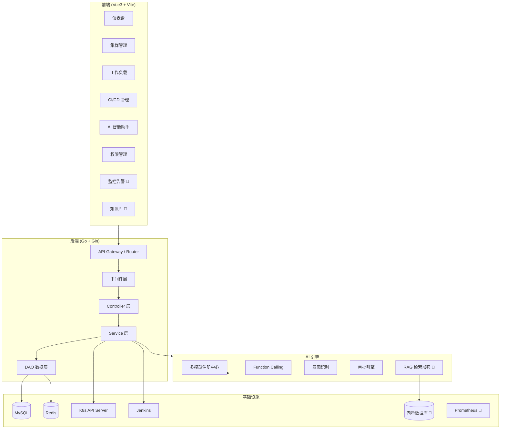

# K8sOperation 平台整体架构总览

> 版本: v2.0 | 更新时间: 2026-04-13

## 一、项目简介

K8sOperation 是一个全栈 Kubernetes 管理平台，集成 **多集群资源治理、CI/CD 发布编排、AI 智能运维助手、三层 RBAC 权限体系** 于一体，提供从开发到生产的一站式运维管理能力。

## 二、技术栈

| 层级 | 技术 | 版本 |
|------|------|------|
| 后端框架 | Go + Gin | Go 1.24.6 |
| K8s 客户端 | client-go | v0.34.2 |
| ORM | GORM | v1.25+ |
| 数据库 | MySQL | 8.0+ |
| 缓存/消息 | Redis | 6.0+ |
| 前端 | Vue3 + Vite | 3.5.13 |
| AI 能力 | OpenAI API 协议 (多模型) | - |
| 认证 | JWT + bcrypt | - |
| 加密 | AES-256-GCM | - |

## 三、系统架构图



> 🔮 标记为未来扩展模块

## 四、后端目录结构

```
k8s_operation/
├── cmd/k8soperation/main.go      # 入口
├── configs/                      # 配置文件
│   ├── config.yaml               # 主配置（DB/Redis/AI/Jenkins 等）
│   └── k8s.yaml                  # K8s 集群 kubeconfig
├── internal/                     # 内部模块（核心业务）
│   ├── app/
│   │   ├── controllers/api/v1/   # 控制器（按资源分目录）
│   │   │   ├── ai/               # AI 助手 API
│   │   │   ├── cicd/             # CI/CD API
│   │   │   └── ...               # K8s 资源 API
│   │   ├── services/             # 业务逻辑层
│   │   │   ├── ai_assistant.go   # AI 对话核心（意图路由/FC循环/审批）
│   │   │   ├── ai_executor.go    # AI 工具执行器（40+工具实现）
│   │   │   ├── ai_tools.go       # AI 工具定义（风险等级/注册表）
│   │   │   ├── cicd_pipeline.go  # CI/CD 流水线
│   │   │   ├── cicd_release.go   # 发布管理
│   │   │   ├── k8s_*.go          # K8s 各资源操作
│   │   │   └── platform_*.go     # 平台设置/健康检查
│   │   ├── models/               # 数据模型（GORM）
│   │   ├── dao/                  # 数据访问层
│   │   ├── routers/              # 路由注册（按资源分目录，25+模块）
│   │   ├── requests/             # 请求参数验证
│   │   └── worker/               # 后台任务
│   ├── errorcode/                # 统一错误码
│   └── server/                   # HTTP 服务器
├── pkg/                          # 公共包（可复用）
│   ├── openai/                   # AI 客户端（Chat/Stream/FC/意图分析）
│   │   ├── client.go             # OpenAI 兼容客户端
│   │   └── registry.go           # 多模型注册中心
│   ├── k8s/                      # K8s 操作封装（21个子模块）
│   ├── jenkins/                  # Jenkins 客户端
│   ├── jwt/                      # JWT 认证
│   └── utils/                    # 通用工具
├── middlewares/                   # Gin 中间件
│   ├── auth.go                   # JWT 认证
│   ├── cluster.go                # 集群上下文（X-Cluster-ID）
│   └── k8serror.go               # K8s 错误统一处理
├── global/                       # 全局变量
└── initialize/                   # 初始化逻辑
```

## 五、前端目录结构

```
k8s-web/src/
├── views/                        # 页面视图
│   ├── ai/                       # AI 助手
│   ├── cicd/                     # CI/CD（流水线/发布/审批）
│   ├── cluster/                  # 集群管理
│   ├── config/                   # ConfigMap/Secret
│   ├── deployment/               # Deployment
│   ├── monitoring/               # 监控 🔮
│   ├── knowledge/                # 知识库 🔮
│   └── ...                       # 其他资源视图
├── components/                   # 公共组件
│   ├── AiAssistant.vue           # AI 悬浮助手
│   └── Layout.vue                # 全局布局
├── api/                          # API 请求封装
├── router/                       # 路由定义
├── stores/                       # Pinia 状态管理
└── assets/                       # 静态资源
```

## 六、核心模块说明

### 6.1 多集群资源管理
- 支持多集群动态接入（kubeconfig 加密存储 AES-256-GCM）
- 通过 `X-Cluster-ID` Header 实现集群上下文切换
- 覆盖 Pod/Deployment/StatefulSet/DaemonSet/Job/CronJob/Service/Ingress/ConfigMap/Secret/PVC/PV/StorageClass/Namespace/Node

### 6.2 CI/CD 发布编排
- Jenkins 集成：流水线创建/触发/回调
- 多语言支持：Go/Java/Vue(Nginx)/Python
- 发布状态机：pending → building → deploying → success/failed
- 多环境管理 + 钉钉通知

### 6.3 AI 智能助手
- **多模型热切换**：支持 OpenAI/DeepSeek/智谱GLM/通义千问/NVIDIA NIM/Moonshot
- **三类对话模式**：
  - 常规问答（通用知识，不调工具）
  - 平台操作（Function Calling，40+ 工具）
  - 高危操作（自动审批流）
- **智能路由**：`needToolCalling()` 关键词预判 → 跳过/启用工具
- **审批引擎**：风险分级（read/write/danger/critical）→ 审批创建 → 管理员操作 → 执行回写

### 6.4 三层 RBAC
- 平台层：超级管理员 / 管理员 / 普通用户
- 集群层：集群管理员 / 运维 / 只读
- 命名空间层：命名空间管理员 / 开发者 / 观察者

## 七、扩展模块规划

| 模块 | 状态 | 设计文档 |
|------|------|---------|
| 监控集成 (Prometheus/Grafana) | 🔮 规划中 | [监控模块扩展设计](./监控模块扩展设计.md) |
| RAG 知识库 | 🔮 规划中 | [RAG知识库扩展设计](./RAG知识库扩展设计.md) |
| AI Agent 自动排障 | 🔮 规划中 | [AI能力演进路线图](./AI能力演进路线图.md) |
| 多租户隔离 | 💡 构想 | - |
| GitOps (ArgoCD) | 💡 构想 | - |
| 服务网格 (Istio) | 💡 构想 | - |

## 八、配置架构

```
优先级：数据库配置 > config.yaml > 代码默认值

config.yaml 分段：
├── Server          # HTTP 服务器配置
├── Database        # MySQL 配置
├── Cache           # Redis 配置
├── App             # 应用日志/JWT/集群默认配置
├── PodLog          # Pod 日志配置
├── Jenkins         # CI/CD 配置
├── Security        # 安全加密配置
├── PlatformSettings # 平台设置（基础/安全/告警/通知）
├── AIAssistant     # AI 助手（多模型提供商配置）
├── Monitoring 🔮   # 监控集成配置（待新增）
└── RAG 🔮          # RAG 知识库配置（待新增）
```

## 九、数据库表概览

| 模块 | 表名 | 说明 |
|------|------|------|
| 用户/权限 | users, roles, user_roles | 用户与 RBAC |
| 集群 | k8s_clusters | 多集群信息 |
| CI/CD | cicd_pipelines, cicd_releases, cicd_stages, cicd_environments | 流水线与发布 |
| AI 对话 | ai_conversations, ai_messages | 会话与消息 |
| AI 审批 | ai_approval_requests, ai_approval_logs | 审批请求与日志 |
| 监控 🔮 | monitor_rules, monitor_alerts | 告警规则与记录 |
| 知识库 🔮 | knowledge_documents, knowledge_chunks | 文档与分片 |
| 审计 | audit_logs | 操作审计 |
