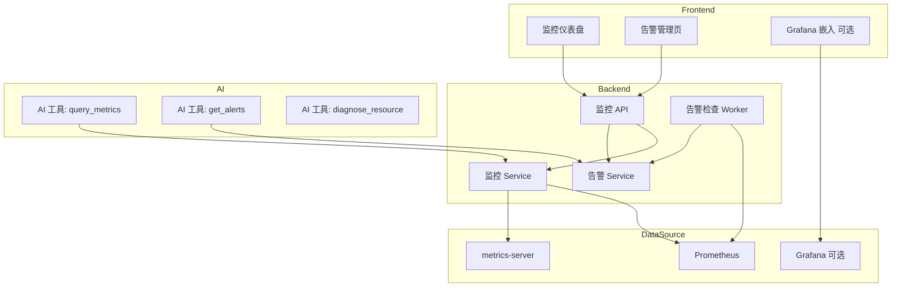

# 监控模块扩展设计文档

> 版本: v1.0 | 状态: 设计中 | 更新时间: 2026-04-13

## 一、目标

为 K8sOperation 平台接入监控能力，实现：
1. **集群资源监控**：Node/Pod CPU、内存、磁盘、网络实时指标
2. **告警管理**：自定义告警规则、告警历史、告警通知
3. **AI 联动**：AI 助手可查询监控指标、分析异常、智能排障建议
4. **可视化**：仪表盘图表展示趋势、热力图、Top N 排行

## 二、架构设计



## 三、数据源对接方案

### 3.1 方案对比

| 方案 | 优点 | 缺点 | 推荐场景 |
|------|------|------|---------|
| **metrics-server 原生** | 零依赖、已有 `get_node_metrics` | 只有实时快照、无历史 | 轻量场景 |
| **Prometheus** | 历史数据、PromQL 强大、生态丰富 | 需部署 Prometheus | 生产推荐 |
| **Prometheus + Grafana** | 开箱即用仪表盘 | 额外部署 Grafana | 完整监控方案 |

### 3.2 推荐：Prometheus + 平台自建图表

```
用户 → 平台前端图表 → 后端 PromQL 查询 → Prometheus
         ↓ (可选)
     Grafana iframe 嵌入
```

## 四、配置设计

```yaml
# config.yaml 新增段
Monitoring:
  Enabled: true
  
  # Prometheus 配置
  Prometheus:
    URL: "http://prometheus:9090"
    Timeout: 30                    # 查询超时(秒)
    MaxSamples: 10000              # 单次查询最大采样点
    
  # Grafana 嵌入(可选)
  Grafana:
    Enabled: false
    URL: "http://grafana:3000"
    Token: ""                      # Service Account Token
    OrgID: 1
    
  # 告警规则默认值
  Alert:
    CheckInterval: 60              # 告警检查间隔(秒)
    DefaultSilence: 15             # 默认静默期(分钟)
    MaxAlertHistory: 1000          # 最大告警历史条数
    
  # 内置告警阈值
  Thresholds:
    NodeCPU: 80                    # 节点 CPU 使用率 %
    NodeMemory: 85                 # 节点内存使用率 %
    NodeDisk: 90                   # 节点磁盘使用率 %
    PodRestart: 5                  # Pod 重启次数阈值
    PodOOMKill: 1                  # OOMKill 次数阈值
```

## 五、后端模块设计

### 5.1 新增文件

```
pkg/prometheus/
  └── client.go                    # Prometheus HTTP 客户端
      - QueryInstant(query)        # 即时查询
      - QueryRange(query, start, end, step)  # 范围查询
      - AlertRules()               # 获取告警规则
      
internal/app/services/
  ├── monitoring.go                # 监控 Service
  │   - GetNodeMetrics(clusterID)             # 节点指标
  │   - GetPodMetrics(clusterID, ns, name)    # Pod 指标
  │   - GetClusterOverview(clusterID)         # 集群总览
  │   - QueryCustom(clusterID, promQL)        # 自定义 PromQL
  │   - GetResourceTrend(resource, duration)  # 资源趋势
  │
  └── monitoring_alert.go          # 告警 Service
      - CreateAlertRule(rule)       # 创建告警规则
      - ListAlertRules()            # 查询告警规则
      - ListAlerts(filter)          # 查询告警历史
      - AcknowledgeAlert(id)        # 确认告警
      - SilenceAlert(id, duration)  # 静默告警
      
internal/app/models/
  ├── monitor_rule.go              # 告警规则模型
  └── monitor_alert.go             # 告警记录模型

internal/app/routers/monitoring/
  └── router.go                    # 监控 API 路由

internal/app/worker/
  └── alert_checker.go             # 告警检查后台任务
```

### 5.2 数据库表设计

```sql
-- 告警规则
CREATE TABLE monitor_rules (
    id           BIGINT UNSIGNED AUTO_INCREMENT PRIMARY KEY,
    name         VARCHAR(128)  NOT NULL COMMENT '规则名称',
    cluster_id   INT UNSIGNED  NOT NULL COMMENT '集群ID',
    resource_type VARCHAR(32)  NOT NULL COMMENT '资源类型: node/pod/deployment',
    metric       VARCHAR(64)   NOT NULL COMMENT '指标名: cpu_usage/mem_usage/restart_count',
    operator     VARCHAR(8)    NOT NULL COMMENT '比较运算符: >/</>=/<=/==/!=',
    threshold    DOUBLE        NOT NULL COMMENT '阈值',
    duration     INT           NOT NULL DEFAULT 60 COMMENT '持续时间(秒)',
    severity     VARCHAR(16)   NOT NULL DEFAULT 'warning' COMMENT 'info/warning/critical',
    enabled      TINYINT(1)    NOT NULL DEFAULT 1,
    notify_channels JSON       COMMENT '通知渠道: ["dingtalk","email","webhook"]',
    created_at   DATETIME      NOT NULL DEFAULT CURRENT_TIMESTAMP,
    updated_at   DATETIME      NOT NULL DEFAULT CURRENT_TIMESTAMP ON UPDATE CURRENT_TIMESTAMP,
    INDEX idx_cluster (cluster_id),
    INDEX idx_enabled (enabled)
) ENGINE=InnoDB COMMENT='监控告警规则';

-- 告警记录
CREATE TABLE monitor_alerts (
    id           BIGINT UNSIGNED AUTO_INCREMENT PRIMARY KEY,
    rule_id      BIGINT UNSIGNED NOT NULL COMMENT '规则ID',
    cluster_id   INT UNSIGNED    NOT NULL COMMENT '集群ID',
    resource_name VARCHAR(128)   NOT NULL COMMENT '资源名称',
    namespace    VARCHAR(64)     DEFAULT '' COMMENT '命名空间',
    severity     VARCHAR(16)     NOT NULL COMMENT 'info/warning/critical',
    message      TEXT            NOT NULL COMMENT '告警详情',
    value        DOUBLE          COMMENT '当前值',
    status       VARCHAR(16)     NOT NULL DEFAULT 'firing' COMMENT 'firing/resolved/silenced/acknowledged',
    fired_at     DATETIME        NOT NULL COMMENT '触发时间',
    resolved_at  DATETIME        COMMENT '恢复时间',
    ack_by       INT UNSIGNED    COMMENT '确认人',
    ack_at       DATETIME        COMMENT '确认时间',
    INDEX idx_status (status),
    INDEX idx_cluster_time (cluster_id, fired_at),
    INDEX idx_rule (rule_id)
) ENGINE=InnoDB COMMENT='监控告警记录';
```

### 5.3 API 设计

```
GET    /api/v1/monitoring/overview          # 集群监控总览
GET    /api/v1/monitoring/nodes             # 节点指标列表
GET    /api/v1/monitoring/nodes/:name       # 单节点指标详情+趋势
GET    /api/v1/monitoring/pods              # Pod 指标列表
GET    /api/v1/monitoring/pods/:ns/:name    # 单 Pod 指标详情
POST   /api/v1/monitoring/query             # 自定义 PromQL 查询
GET    /api/v1/monitoring/trend/:resource   # 资源趋势图数据

GET    /api/v1/monitoring/rules             # 告警规则列表
POST   /api/v1/monitoring/rules             # 创建告警规则
PUT    /api/v1/monitoring/rules/:id         # 更新告警规则
DELETE /api/v1/monitoring/rules/:id         # 删除告警规则

GET    /api/v1/monitoring/alerts            # 告警记录列表
POST   /api/v1/monitoring/alerts/:id/ack    # 确认告警
POST   /api/v1/monitoring/alerts/:id/silence # 静默告警
```

## 六、AI 助手集成

### 6.1 新增工具定义

```go
// ai_tools.go 新增
"query_metrics":     {Name: "query_metrics", RiskLevel: RiskRead, Description: "查询资源监控指标"},
"get_alerts":        {Name: "get_alerts", RiskLevel: RiskRead, Description: "查看当前告警"},
"get_resource_trend":{Name: "get_resource_trend", RiskLevel: RiskRead, Description: "查看资源使用趋势"},
"diagnose_resource": {Name: "diagnose_resource", RiskLevel: RiskRead, Description: "智能诊断资源异常"},
```

### 6.2 AI 诊断流程


### 6.3 needToolCalling 扩展

```go
// 在 platformKeywords 中新增
"监控", "指标", "告警", "metric", "alert",
"cpu使用率", "内存使用率", "磁盘", "disk",
"诊断", "排查", "分析", "异常", "故障",
```

## 七、前端页面设计

### 7.1 新增路由

```javascript
// router/index.js 新增
{ path: '/monitoring', component: MonitoringDashboard, name: '监控总览' },
{ path: '/monitoring/nodes', component: NodeMetrics, name: '节点监控' },
{ path: '/monitoring/alerts', component: AlertManagement, name: '告警管理' },
{ path: '/monitoring/rules', component: AlertRules, name: '告警规则' },
```

### 7.2 页面布局

```
监控总览页:
┌──────────────────────────────────────────────┐
│  集群健康状态    节点数  Pod数  告警数          │
│  ██ 健康        3/3    42/50  2 ⚠️           │
├──────────────────────────────────────────────┤
│  CPU 使用率趋势          │ 内存使用率趋势      │
│  📈 [折线图]             │ 📈 [折线图]         │
├──────────────────────────────────────────────┤
│  节点资源 Top 5          │ Pod 资源 Top 5      │
│  ┌─────────────────┐    │ ┌─────────────────┐ │
│  │ node-1  CPU 78% │    │ │ nginx   CPU 45% │ │
│  │ node-2  CPU 62% │    │ │ api     CPU 38% │ │
│  └─────────────────┘    │ └─────────────────┘ │
├──────────────────────────────────────────────┤
│  最近告警                                     │
│  🔴 node-1 CPU > 80% (5分钟前)               │
│  🟡 pod/api-xxx 重启次数 > 3 (15分钟前)       │
└──────────────────────────────────────────────┘
```

## 八、推荐图表库

| 库 | 特点 | 推荐度 |
|----|------|--------|
| **ECharts** | 功能最全、中文文档、Vue 组件成熟 | 推荐 |
| Chart.js | 轻量、简洁 | 备选 |
| D3.js | 灵活但学习成本高 | 不推荐 |

## 九、实施步骤

```
Phase 1: 基础监控 (2-3天)
  ├── 1. 新增 pkg/prometheus/client.go
  ├── 2. 新增 monitoring service + router
  ├── 3. 前端监控总览页（ECharts 图表）
  └── 4. AI 工具 query_metrics 集成

Phase 2: 告警系统 (2-3天)
  ├── 1. 数据库建表 + DAO
  ├── 2. 告警规则 CRUD
  ├── 3. 告警检查 Worker（后台定时任务）
  ├── 4. 告警通知（钉钉/邮件/Webhook）
  └── 5. 前端告警管理页

Phase 3: AI 智能诊断 (1-2天)
  ├── 1. diagnose_resource 工具实现
  ├── 2. 异常→指标→事件 关联分析
  └── 3. AI 自动排障建议
```
